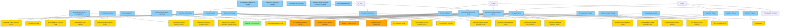

<!-- @format -->

# 🌐 Master Relationship Map

```mermaid
graph TD
    classDef framework fill:#87CEFA,stroke:#333,stroke-width:1px;
    classDef prompt fill:#FFA500,stroke:#333,stroke-width:1px;
    classDef reference fill:#90EE90,stroke:#333,stroke-width:1px;
    classDef analysis fill:#FFD700,stroke:#333,stroke-width:1px;
    A_Attachment_Example__Long_["Attachment Example (Long)"]:::analysis
    A_Attachment_Prompt_Example["Attachment Prompt Example"]:::analysis
    A_Boundary_Models_Example__Long_["Boundary Models Example (Long)"]:::analysis
    A_Conflict_Prompt_Example["Conflict Prompt Example"]:::analysis
    A_Containment_Models_Example__Long_["Containment Models Example (Long)"]:::analysis
    A_EFT_Example__Long_["EFT Example (Long)"]:::analysis
    A_Empowerment_Triangle_Example__Long_["Empowerment Triangle Example (Long)"]:::analysis
    A_GPT_Master_Prompt_Example["GPT Master Prompt Example"]:::analysis
    A_Gottman_Method_Example__Long_["Gottman Method Example (Long)"]:::analysis
    A_IFS_Example["IFS Example"]:::analysis
    A_Intersectional_Feminist_Psychology_Example__Long_["Intersectional Feminist Psychology Example (Long)"]:::analysis
    A_Karpman_Drama_Triangle_Example__Long_["Karpman Drama Triangle Example (Long)"]:::analysis
    A_Liberation_Psychology_Example__Long_["Liberation Psychology Example (Long)"]:::analysis
    A_NVC_Example__Long_["NVC Example (Long)"]:::analysis
    A_Narrative_Therapy_Example__Long_["Narrative Therapy Example (Long)"]:::analysis
    A_Polyvagal_Example["Polyvagal Example"]:::analysis
    A_Relational_Theory_Example__Long_["Relational Theory Example (Long)"]:::analysis
    A_Repair_Attempts_Prompt_Example["Repair Attempts Prompt Example"]:::analysis
    A_Somatic_Experiencing_Example__Long_["Somatic Experiencing Example (Long)"]:::analysis
    A_Systems_Thinking_Example__Long_["Systems Thinking Example (Long)"]:::analysis
    A_Transactional_Analysis_Example__Long_["Transactional Analysis Example (Long)"]:::analysis
    A_Trauma_Informed_Care_Example__Long_["Trauma-Informed Care Example (Long)"]:::analysis
    F_Attachment_Theory["Attachment Theory"]:::framework
    F_Boundary_Models["Boundary Models"]:::framework
    F_Boundary___Containment_Models["Boundary & Containment Models"]:::framework
    F_Consent_Culture["Consent Culture"]:::framework
    F_Containment_Models["Containment Models"]:::framework
    F_Emotionally_Focused_Therapy__EFT_["Emotionally Focused Therapy (EFT)"]:::framework
    F_Empowerment_Triangle["Empowerment Triangle"]:::framework
    F_Framework_Reference_Template["Framework Reference Template"]:::framework
    F_Gottman_Method["Gottman Method"]:::framework
    F_Internal_Family_Systems__IFS_["Internal Family Systems (IFS)"]:::framework
    F_Intersectional_Feminist_Psychology["Intersectional Feminist Psychology"]:::framework
    F_Intersectional_Psychology["Intersectional Psychology"]:::framework
    F_Karpman_Drama_Triangle["Karpman Drama Triangle"]:::framework
    F_Liberation_Psychology["Liberation Psychology"]:::framework
    F_Liberation___Intersectional_Feminist_Psychology["Liberation & Intersectional Feminist Psychology"]:::framework
    F_Narrative_Therapy["Narrative Therapy"]:::framework
    F_Nonviolent_Communication__NVC_["Nonviolent Communication (NVC)"]:::framework
    F_Polyvagal_Theory["Polyvagal Theory"]:::framework
    F_Relational_Theory["Relational Theory"]:::framework
    F_Somatic_Experiencing["Somatic Experiencing"]:::framework
    F_Systems_Thinking["Systems Thinking"]:::framework
    F_Transactional_Analysis["Transactional Analysis"]:::framework
    F_Trauma_Informed_Care["Trauma-Informed Care"]:::framework
    P_Analysis_Prompt___Attachment["Analysis Prompt - Attachment"]:::prompt
    P_Analysis_Prompt___Conflict["Analysis Prompt - Conflict"]:::prompt
    P_Analysis_Prompt___Repair_Attempts["Analysis Prompt - Repair Attempts"]:::prompt
    P_GPT_Relational_Analysis_Prompt["GPT Relational Analysis Prompt"]:::prompt
    R_Example_Conversations["Example Conversations"]:::reference
F_Attachment_Theory --> A_Attachment_Prompt_Example
F_Attachment_Theory --> A_Conflict_Prompt_Example
F_Attachment_Theory --> A_EFT_Example__Long_
F_Attachment_Theory --> A_Gottman_Method_Example__Long_
F_Attachment_Theory --> A_Polyvagal_Example
F_Attachment_Theory --> A_Relational_Theory_Example__Long_
F_Attachment_Theory --> P_Analysis_Prompt___Attachment
F_Attachment_Theory --> P_Analysis_Prompt___Conflict
F_Attachment_Theory --> P_Analysis_Prompt___Repair_Attempts
F_Attachment_Theory --> P_GPT_Relational_Analysis_Prompt
F_Attachment_Theory --> R_Example_Conversations
F_Boundary_Models --> A_Containment_Models_Example__Long_
F_Consent_Culture --> A_Boundary_Models_Example__Long_
F_Consent_Culture --> A_Intersectional_Feminist_Psychology_Example__Long_
F_Consent_Culture --> A_Liberation_Psychology_Example__Long_
F_Consent_Culture --> A_Relational_Theory_Example__Long_
F_Consent_Culture --> A_Trauma_Informed_Care_Example__Long_
F_Containment_Models --> A_Boundary_Models_Example__Long_
F_Emotionally_Focused_Therapy__EFT_ --> A_Attachment_Example__Long_
F_Emotionally_Focused_Therapy__EFT_ --> A_Attachment_Prompt_Example
F_Emotionally_Focused_Therapy__EFT_ --> A_Gottman_Method_Example__Long_
F_Emotionally_Focused_Therapy__EFT_ --> A_Polyvagal_Example
F_Empowerment_Triangle --> A_Karpman_Drama_Triangle_Example__Long_
F_Gottman_Method --> A_Attachment_Example__Long_
F_Gottman_Method --> A_NVC_Example__Long_
F_Gottman_Method --> A_Repair_Attempts_Prompt_Example
F_Gottman_Method --> A_Systems_Thinking_Example__Long_
F_Gottman_Method --> P_Analysis_Prompt___Attachment
F_Gottman_Method --> P_Analysis_Prompt___Conflict
F_Gottman_Method --> P_Analysis_Prompt___Repair_Attempts
F_Gottman_Method --> P_GPT_Relational_Analysis_Prompt
F_Gottman_Method --> R_Example_Conversations
F_Internal_Family_Systems__IFS_ --> A_GPT_Master_Prompt_Example
F_Internal_Family_Systems__IFS_ --> A_Narrative_Therapy_Example__Long_
F_Internal_Family_Systems__IFS_ --> P_Analysis_Prompt___Attachment
F_Internal_Family_Systems__IFS_ --> P_Analysis_Prompt___Conflict
F_Internal_Family_Systems__IFS_ --> P_Analysis_Prompt___Repair_Attempts
F_Internal_Family_Systems__IFS_ --> P_GPT_Relational_Analysis_Prompt
F_Intersectional_Feminist_Psychology --> A_Liberation_Psychology_Example__Long_
F_Karpman_Drama_Triangle --> A_Empowerment_Triangle_Example__Long_
F_Karpman_Drama_Triangle --> A_Systems_Thinking_Example__Long_
F_Karpman_Drama_Triangle --> A_Transactional_Analysis_Example__Long_
F_Liberation_Psychology --> A_Intersectional_Feminist_Psychology_Example__Long_
F_Narrative_Therapy --> A_IFS_Example
F_Nonviolent_Communication__NVC_ --> A_IFS_Example
F_Nonviolent_Communication__NVC_ --> A_Narrative_Therapy_Example__Long_
F_Nonviolent_Communication__NVC_ --> A_Repair_Attempts_Prompt_Example
F_Nonviolent_Communication__NVC_ --> A_Transactional_Analysis_Example__Long_
F_Nonviolent_Communication__NVC_ --> P_Analysis_Prompt___Attachment
F_Nonviolent_Communication__NVC_ --> P_Analysis_Prompt___Conflict
F_Nonviolent_Communication__NVC_ --> P_Analysis_Prompt___Repair_Attempts
F_Nonviolent_Communication__NVC_ --> P_GPT_Relational_Analysis_Prompt
F_Nonviolent_Communication__NVC_ --> R_Example_Conversations
F_Polyvagal_Theory --> A_Conflict_Prompt_Example
F_Polyvagal_Theory --> A_EFT_Example__Long_
F_Polyvagal_Theory --> A_GPT_Master_Prompt_Example
F_Polyvagal_Theory --> A_Somatic_Experiencing_Example__Long_
F_Polyvagal_Theory --> A_Trauma_Informed_Care_Example__Long_
F_Polyvagal_Theory --> P_Analysis_Prompt___Attachment
F_Polyvagal_Theory --> P_Analysis_Prompt___Conflict
F_Polyvagal_Theory --> P_Analysis_Prompt___Repair_Attempts
F_Polyvagal_Theory --> P_GPT_Relational_Analysis_Prompt
F_Relational_Theory --> A_Systems_Thinking_Example__Long_
F_Systems_Thinking --> A_Empowerment_Triangle_Example__Long_
F_Transactional_Analysis --> A_Karpman_Drama_Triangle_Example__Long_
F_Transactional_Analysis --> A_NVC_Example__Long_
F_Trauma_Informed_Care --> A_Containment_Models_Example__Long_
F_Trauma_Informed_Care --> A_Somatic_Experiencing_Example__Long_
F_DBT --> F_Internal_Family_Systems__IFS_
F_DBT --> F_Trauma_Informed_Care
F_DBT --> F_Consent_Culture
F_CBT --> F_Nonviolent_Communication__NVC_
F_CBT --> F_Narrative_Therapy
F_CBT --> F_Gottman_Method
F_ACT --> F_Polyvagal_Theory
F_ACT --> F_Relational_Theory
F_ACT --> P_Reflection_Prompts
```

## 🔗 Related Frameworks

- [[Art-Based_Relational_Mapping]]
