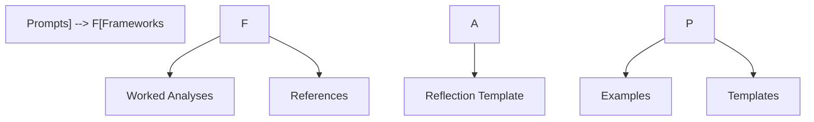

# 🌠Vault Graph Overview

```mermaid
graph TD
Prompts______F_Frameworks["Prompts] --> F[Frameworks"]
F --> Worked_Analyses["Worked Analyses"]
A --> Reflection_Template["Reflection Template"]
P --> Examples["Examples"]
F --> References["References"]
P --> Templates["Templates"]
```
