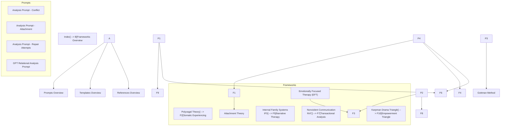

<!-- @format -->

# 🕸 Vault Graph

```mermaid
graph TD
Index______B_Frameworks_Overview["Index] --> B[Frameworks Overview"]
A --> Prompts_Overview["Prompts Overview"]
A --> Templates_Overview["Templates Overview"]
A --> References_Overview["References Overview"]

    subgraph Frameworks
Polyvagal_Theory______F2_Somatic_Experiencing["Polyvagal Theory] --> F2[Somatic Experiencing"]
F1 --> Attachment_Theory["Attachment Theory"]
Internal_Family_Systems__IFS_______F5_Narrative_Therapy["Internal Family Systems<br/>IFS] --> F5[Narrative Therapy"]
Nonviolent_Communication__NVC_______F7_Transactional_Analysis["Nonviolent Communication<br/>NVC] --> F7[Transactional Analysis"]
Emotionally_Focused_Therapy__EFT_["Emotionally Focused Therapy (EFT)"] --> F3
Karpman_Drama_Triangle______F10_Empowerment_Triangle["Karpman Drama Triangle] --> F10[Empowerment Triangle"]
    end

    subgraph Prompts
Analysis_Prompt___Conflict["Analysis Prompt - Conflict"]
Analysis_Prompt___Attachment["Analysis Prompt - Attachment"]
Analysis_Prompt___Repair_Attempts["Analysis Prompt - Repair Attempts"]
GPT_Relational_Analysis_Prompt["GPT Relational Analysis Prompt"]
    end

P1 --> F9
P1 --> F6
P2 --> F3
P2 --> F8
P3 --> Gottman_Method["Gottman Method"]
P4 --> F1
P4 --> F4
P4 --> F6
```
