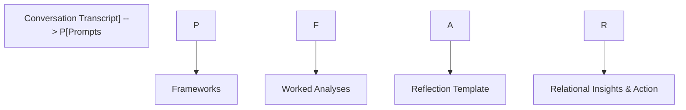

<!-- @format -->

# 🔀 Workflow Map

```mermaid
graph TD
Conversation_Transcript______P_Prompts["Conversation Transcript] --> P[Prompts"]
P --> Frameworks["Frameworks"]
F --> Worked_Analyses["Worked Analyses"]
A --> Reflection_Template["Reflection Template"]
R --> Relational_Insights___Action["Relational Insights & Action"]
```
